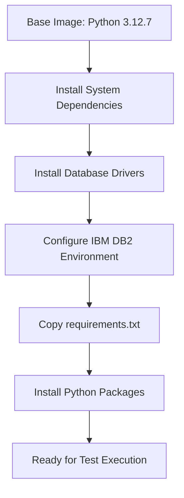

# Docker Compose Architecture Documentation

## Overview

The Docker Compose setup for the SnapLogic Robot Framework testing environment consists of a main orchestration file (`docker-compose.yml`) that builds and manages multiple services, with the primary `tools` service serving as the test execution container.

## Architecture Diagram

```
┌─────────────────────────────────────────────────────────────┐
│                     docker-compose.yml                       │
│                         (Main File)                          │
├─────────────────────────────────────────────────────────────┤
│                                                              │
│  Includes Multiple Service Files:                           │
│  ├── docker-compose.oracle.yml      (Oracle DB)            │
│  ├── docker-compose.groundplex.yml  (SnapLogic Groundplex) │
│  ├── docker-compose.s3emulator.yml  (MinIO S3)            │
│  ├── docker-compose.postgres.yml    (PostgreSQL)          │
│  ├── docker-compose.activemq.yml    (JMS Server)          │
│  ├── docker-compose.sqlserver.yml   (SQL Server)          │
│  ├── docker-compose.mysql.yml       (MySQL)               │
│  ├── docker-compose.db2.yml         (DB2)                 │
│  ├── docker-compose.salesforce-mock.yml (Mock API)        │
│  └── docker-compose.kafka.yml       (Kafka)               │
│                                                              │
│  Main Service:                                              │
│  └── tools (Test Execution Container)                       │
│      ├── Builds from: docker/robot.Dockerfile              │
│      ├── Installs: src/tools/requirements.txt             │
│      └── Runs: Robot Framework Tests                       │
└─────────────────────────────────────────────────────────────┘
```

## Main Docker Compose File Structure

### File Location
- **Path**: `/snaplogic-robotframework-examples/docker/docker-compose.yml`
- **Purpose**: Central orchestration file that coordinates all services needed for testing

### Key Components

#### 1. Include Section
The compose file uses Docker Compose's `include` feature to modularize service definitions:

```yaml
include:
  - docker-compose.oracle.yml
  - docker-compose.groundplex.yml
  - docker-compose.s3emulator.yml
  # ... other service files
```

**Benefits**:
- **Modularity**: Each service is defined in its own file
- **Maintainability**: Easy to add/remove services
- **Clarity**: Prevents a single massive compose file
- **Reusability**: Services can be used independently

#### 2. Tools Service Configuration

The `tools` service is the heart of the testing framework:

| Configuration | Value/Purpose | Details |
|--------------|---------------|---------|
| **Service Name** | `tools` | Primary test execution container |
| **Container Name** | `snaplogic-test-example-tools-container` | Unique identifier for the container |
| **Image** | `snaplogic-test-example:latest` | Tagged image name after build |
| **Profile** | `tools` | Allows selective service startup |
| **Network** | `snaplogicnet` | Shared network for all services |

## Tools Service Deep Dive

### Build Configuration

```yaml
build:
  context: ../src/tools
  dockerfile: ../../docker/robot.Dockerfile
```

| Aspect | Description |
|--------|------------|
| **Context** | `../src/tools` - Directory containing requirements.txt |
| **Dockerfile** | `../../docker/robot.Dockerfile` - Build instructions |
| **Platform** | `linux/amd64` - Forces x86_64 for IBM DB2 compatibility |

### Environment Variables

The tools service inherits environment variables from multiple sources:

| Source | Purpose | Examples |
|--------|---------|----------|
| **`.env` file** | User credentials and configuration | `URL`, `ORG_ADMIN_USER`, `PROJECT_SPACE` |
| **Travis CI variables** | CI/CD integration | `TRAVIS_BUILD_NUMBER`, `TRAVIS_BRANCH` |
| **Runtime variables** | Dynamic configuration | Test tags, execution parameters |

### Volume Mounts

Critical volume mappings that enable test execution:

| Host Path | Container Path | Purpose |
|-----------|----------------|---------|
| `../src` | `/app/src` | Source code and pipelines |
| `../test` | `/app/test` | Test suites and resources |
| `../.env` | `/app/.env` | Environment configuration |
| `../setup_env.sh` | `/app/setup_env.sh` | Environment setup script |
| `../test/suite/test_data` | `/opt/snaplogic/test_data` | Test data files |

**Optional Mounts** (commented by default):
- `~/Documents:/opt/host-documents:ro` - Read-only access to host documents
- `~/Downloads:/opt/host-downloads:ro` - Read-only access to host downloads
- `~/Desktop:/opt/host-desktop:ro` - Read-only access to host desktop

## Dockerfile Details

### File Location
- **Path**: `/snaplogic-robotframework-examples/docker/robot.Dockerfile`
- **Base Image**: `python:3.12.7-slim-bookworm`

### Build Process Flow



### System Dependencies Installation

| Package | Purpose |
|---------|---------|
| `gcc` | C compiler for building Python extensions |
| `g++` | C++ compiler for certain database drivers |
| `unixodbc-dev` | ODBC driver development files |
| `wget` | Download IBM DB2 CLI driver |
| `libxml2` | XML processing library |

### Platform-Specific Handling

The Dockerfile includes intelligent platform detection:

```dockerfile
RUN if [ "$(uname -m)" != "aarch64" ]; then \
    # Install IBM DB2 driver for x86_64 only
fi
```

- **x86_64 (Intel/AMD)**: Full installation including IBM DB2
- **ARM64 (Apple Silicon)**: Skips IBM DB2 due to compatibility

## Requirements File

### Location
- **Path**: `/snaplogic-robotframework-examples/src/tools/requirements.txt`

### Key Python Libraries

| Library | Purpose | Used For |
|---------|---------|----------|
| **snaplogic-common-robot** | Core Robot Framework library | SnapLogic-specific keywords and APIs |
| **robotframework-pabot** | Parallel test execution | Running tests in parallel |
| **oracledb** | Oracle database driver | Oracle database testing |
| **psycopg2-binary** | PostgreSQL driver | PostgreSQL testing |
| **pymssql** | SQL Server driver | Microsoft SQL Server testing |
| **pymysql** | MySQL driver | MySQL database testing |
| **ibm_db** | IBM DB2 driver | DB2 database testing |
| **teradatasql** | Teradata driver | Teradata database testing |
| **snowflake-connector-python** | Snowflake driver | Snowflake cloud DB testing |
| **minio** | MinIO client | S3-compatible storage testing |
| **stomp.py** | STOMP protocol client | JMS/ActiveMQ testing |
| **requests** | HTTP client | REST API testing |

## Network Configuration

### Network Name: `snaplogicnet`

All services communicate through a shared bridge network:

```yaml
networks:
  snaplogicnet:
    driver: bridge
```

**Benefits**:
- **Service Discovery**: Services can reach each other by container name
- **Isolation**: Isolated from host network
- **Security**: Only exposed ports are accessible from host

## Service Profiles

Profiles allow selective service startup:

```yaml
profiles: [tools]
```

**Usage Examples**:
```bash
# Start only tools service
docker-compose --profile tools up

# Start tools with databases
docker-compose --profile tools --profile oracle-dev up

# Start everything
COMPOSE_PROFILES=tools,oracle-dev,postgres-dev make start-services
```

## Container Lifecycle

### Startup Command

```yaml
command: ["sh", "-c", "echo 'Tools container started' && tail -f /dev/null"]
```

- Prints startup message
- Keeps container running indefinitely
- Allows interactive test execution

### Test Execution Flow

1. **Container Start**: Tools container starts and remains running
2. **Test Trigger**: Makefile targets execute Robot Framework inside container
3. **Test Run**: Tests interact with other services via `snaplogicnet`
4. **Results**: Output saved to mounted volumes
5. **Container Persist**: Container stays running for next test run

## Integration with Makefile

The Docker Compose setup is primarily controlled through Makefile targets:

| Makefile Target | Docker Compose Action |
|-----------------|----------------------|
| `snaplogic-build-tools` | Builds tools container image |
| `start-services` | Starts services with profiles |
| `robot-run-tests` | Executes tests inside tools container |
| `snaplogic-stop` | Stops all containers and cleanup |

## Best Practices

### 1. Environment Configuration
- Keep sensitive data in `.env` file (never commit)
- Use environment-specific `.env` files for different stages

### 2. Volume Management
- Mount only necessary directories
- Use read-only mounts where possible
- Keep test data organized in designated directories

### 3. Service Dependencies
- Use profiles to control service startup
- Start only required services for specific tests
- Clean up resources after test completion

### 4. Platform Compatibility
- Test on both x86_64 and ARM64 if possible
- Document platform-specific limitations
- Provide alternatives for incompatible components

## Troubleshooting

### Common Issues and Solutions

| Issue | Cause | Solution |
|-------|-------|----------|
| Container fails to build | Missing requirements | Check `requirements.txt` exists |
| IBM DB2 errors on Mac M1 | ARM64 incompatibility | DB2 is auto-skipped on ARM |
| Services can't communicate | Network issues | Ensure all use `snaplogicnet` |
| Permission denied errors | Volume mount permissions | Check file permissions on host |
| Out of memory | Resource limits | Increase Docker memory allocation |

### Debugging Commands

```bash
# View container logs
docker-compose logs tools

# Enter tools container
docker exec -it snaplogic-test-example-tools-container bash

# Check network connectivity
docker exec tools ping oracle-db

# Inspect volume mounts
docker inspect snaplogic-test-example-tools-container

# Check installed packages
docker exec tools pip list
```

## Summary

The Docker Compose architecture provides:

1. **Centralized orchestration** through the main `docker-compose.yml`
2. **Modular service definitions** via included YAML files
3. **Consistent test environment** through the tools container
4. **Flexible configuration** using profiles and environment variables
5. **Cross-platform compatibility** with intelligent platform detection
6. **Comprehensive database support** through installed drivers
7. **Isolated networking** for secure service communication

This architecture ensures reproducible, scalable, and maintainable test execution across different environments and platforms.

---

*Last Updated: 2025*
*File Locations*:
- Main Compose: `/docker/docker-compose.yml`
- Dockerfile: `/docker/robot.Dockerfile`
- Requirements: `/src/tools/requirements.txt`