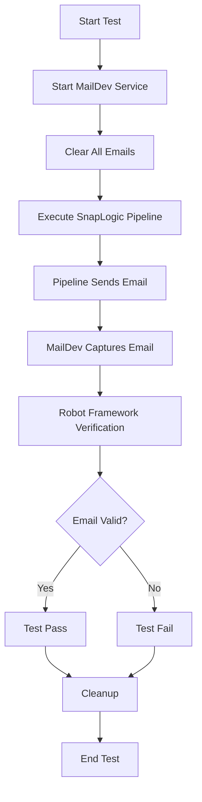

# MailDev Mock Email Server - Complete Testing Guide

## 📧 What is This?
**MailDev is a mock email server (fake SMTP server) designed for testing email functionality without sending real emails.** It acts as a complete email service replacement during development and testing, capturing all emails sent to it in a local environment.

### Key Point: This is NOT a Real Email Service
- **Mock Server**: MailDev simulates a real email server but doesn't actually send emails anywhere
- **Testing Only**: All emails are trapped locally for inspection and verification
- **No Internet Required**: Emails never leave your local/test environment
- **Perfect for Testing**: Safely test email functionality without risk of sending to real recipients

## Table of Contents
1. [Overview](#overview)
2. [Architecture](#architecture)
3. [Docker Configuration](#docker-configuration)
4. [Account Configuration](#account-configuration)
5. [Makefile Commands](#makefile-commands)
6. [Robot Framework Integration](#robot-framework-integration)
7. [Email Utility Keywords](#email-utility-keywords)
8. [Testing Workflow](#testing-workflow)
9. [Troubleshooting](#troubleshooting)
10. [Best Practices](#best-practices)

---

## Overview

### What is MailDev Mock Server?
MailDev is a mock SMTP server (fake email service) used to test your project's email functionality during development. It provides:
- A **mock SMTP server** that pretends to be a real email service
- A **fake inbox** that captures all emails without sending them anywhere
- A **web interface** to view and inspect captured emails
- **API endpoints** for automated testing verification

Think of it as a "email simulator" that acts like Gmail or Outlook but keeps everything local.

### Why Use MailDev for Testing?
- **Safety**: No risk of accidentally sending test emails to real customers
- **Speed**: Instant email delivery without network delays
- **Visibility**: Full inspection of email headers, body, and attachments
- **Simplicity**: No authentication or real email accounts needed
- **Isolation**: Each developer gets their own email server instance

### The Hotel Mail Room Analogy
Think of MailDev as a hotel's mail room during a conference:
- Instead of sending letters to real addresses, all mail goes to the hotel mail room
- You can walk to the mail room (web interface) and see all the mail
- The mail slot (SMTP port) accepts any envelope
- Nothing actually leaves the hotel

---

## Architecture

### System Components

```
┌─────────────────────────────────────────────────────────────┐
│                     Testing Environment                      │
├─────────────────────────────────────────────────────────────┤
│                                                              │
│  ┌──────────────────┐         ┌──────────────────┐         │
│  │   SnapLogic      │         │     MailDev      │         │
│  │   Pipeline       │  SMTP   │    Container     │         │
│  │  (Email Snap)    │-------->│                  │         │
│  └──────────────────┘  :1025  │  ┌────────────┐ │         │
│                                │  │  Inbox     │ │         │
│  ┌──────────────────┐         │  │  Storage   │ │         │
│  │  Robot Framework │  API    │  └────────────┘ │         │
│  │   Test Suite     │-------->│                  │         │
│  └──────────────────┘  :1080  │  ┌────────────┐ │         │
│                                │  │  Web UI    │ │         │
│  ┌──────────────────┐         │  │  Server    │ │         │
│  │    Developer     │  HTTP   │  └────────────┘ │         │
│  │    Browser       │-------->│                  │         │
│  └──────────────────┘  :1080  └──────────────────┘         │
│                                                              │
│                     Docker Network: snaplogicnet            │
└─────────────────────────────────────────────────────────────┘
```

### Port Configuration
- **Port 1025**: SMTP server (receives emails)
- **Port 1080**: Web UI (view and manage emails)

### Network Flow
1. SnapLogic Email Snap sends email to `maildev-test:1025`
2. MailDev captures the email in memory
3. Robot Framework tests verify email via API at `maildev-test:1080`
4. Developers can view emails at `http://localhost:1080`

---

## Docker Configuration

### Docker Compose File (`docker-compose.email-mock.yml`)

```yaml
version: '3.8'

services:
  maildev:
    image: maildev/maildev:latest          # Official MailDev image
    container_name: maildev-test           # Container name for reference
    restart: unless-stopped                # Auto-restart policy
    
    ports:
      - "${MAILDEV_SMTP_PORT:-1025}:1025"  # SMTP server port
      - "${MAILDEV_WEB_PORT:-1080}:1080"   # Web UI port
    
    environment:
      MAILDEV_SMTP_PORT: 1025              # Internal SMTP port
      MAILDEV_WEB_PORT: 1080                # Internal web port
      # Optional: Add basic auth for shared environments
      # MAILDEV_WEB_USER: admin
      # MAILDEV_WEB_PASS: changeme
    
    command: ["--hide-extensions", "STARTTLS", "--web-ip", "0.0.0.0"]
    profiles: [email-mock]                  # Docker profile for organization
    
    networks:
      - snaplogicnet                        # Shared network with Groundplex
    
    logging:
      driver: "json-file"
      options:
        max-size: "10m"                    # Log rotation settings
        max-file: "3"

networks:
  snaplogicnet:
    driver: bridge                          # Bridge network for container communication
```

### Key Configuration Points
- **Container Name**: `maildev-test` - Used by other services to connect
- **Network**: `snaplogicnet` - Allows communication with Groundplex
- **Profiles**: `email-mock` - Organized service grouping
- **Logging**: Configured with rotation to prevent disk space issues

---

## Account Configuration

### Environment Variables (`.env.accounts`)

```bash
# ============================================
# EMAIL/SMTP ACCOUNT
# ============================================
EMAIL_ACCOUNT_NAME=mail_acct        # Account name in SnapLogic
EMAIL_ID=test@example.com           # Dummy email (not used by MailDev)
EMAIL_PASSWORD=test                 # Dummy password (not used by MailDev)
EMAIL_SERVER_DOMAIN=maildev-test    # Docker container name
EMAIL_PORT=1025                     # SMTP port
EMAIL_SECURE_CONNECTION=NONE        # No encryption needed for testing
```

### SnapLogic Email Snap Configuration
When configuring the Email Snap in SnapLogic:
1. **SMTP Server**: `maildev-test` (or `localhost` from host machine)
2. **Port**: `1025`
3. **Authentication**: None required
4. **Encryption**: None
5. **From Email**: Any valid email format (e.g., `test@example.com`)

---

## Makefile Commands

### Available Commands

| Command         | Description             | Usage                |
| --------------- | ----------------------- | -------------------- |
| `email-start`   | Start MailDev server    | `make email-start`   |
| `email-stop`    | Stop and remove MailDev | `make email-stop`    |
| `email-restart` | Restart MailDev         | `make email-restart` |
| `email-status`  | Check service health    | `make email-status`  |
| `email-clean`   | Clean and restart fresh | `make email-clean`   |
| `email-logs`    | View container logs     | `make email-logs`    |
| `email-test`    | Send test email         | `make email-test`    |
| `email-web`     | Open web interface      | `make email-web`     |

### Command Examples

```bash
# Start the email service
$ make email-start
📧 Starting MailDev email testing server...
✅ MailDev email server started!

# Check status
$ make email-status
✅ MailDev container is running
   Container: maildev-test
   SMTP Port: 1025
   Web UI Port: 1080
   📬 Emails in inbox: 3

# Send a test email
$ make email-test
📤 Sending test email via Python...
✅ Test email sent successfully!
📬 View the email at: http://localhost:1080

# Clean all emails and restart
$ make email-clean
🧹 Cleaning and restarting MailDev email server...
📬 All previous emails have been cleared.
```

---

## Robot Framework Integration

### Test Suite Structure (`email_test.robot`)

```robotframework
*** Settings ***
Documentation       Email Testing with MailDev Integration
Library             RequestsLibrary
Resource            email_utils.resource

*** Variables ***
${MAILDEV_URL}              http://maildev-test:1080
${SMTP_HOST}                localhost
${SMTP_PORT}                1025
${TEST_FROM_EMAIL}          test-sender@example.com
${TEST_TO_EMAIL}            test-recipient@example.com
${TEST_CC_EMAIL}            test-cc@example.com
${SUBJECT}                  Test Email Subject
${TEMPLATE_BODY}            Hello, this is a test email

*** Test Cases ***
Verify Email Setup
    [Documentation]    Verifies email was sent and received correctly
    
    # Get and validate the latest email
    Get And Validate Latest Email    ${MAILDEV_URL}
    
    # Verify recipients
    Verify Email TO Recipient    ${TEST_TO_EMAIL}
    Verify Email CC Recipient    ${TEST_CC_EMAIL}
    
    # Verify content
    Verify Email Subject    ${SUBJECT}
    Verify Email Body Equals    ${TEMPLATE_BODY}
```

### Test Workflow
1. **Setup**: Clear all existing emails in MailDev
2. **Execute**: Run SnapLogic pipeline that sends email
3. **Verify**: Use Robot Framework keywords to validate email
4. **Cleanup**: Optionally clear emails after test

---

## Email Utility Keywords

> **📌 Note:** This is an actively developed utility library. Some keywords are still being enhanced and new keywords are being added to expand testing capabilities. The keywords listed below are currently available and stable for use in test cases.

### Development Status
- ✅ **Production Ready**: All keywords listed below are tested and ready for use
- 🚧 **In Development**: Additional keywords for attachment handling, email filtering, and bulk operations are being developed
- 📝 **Planned Features**: Advanced email search, template validation, and performance testing utilities

### Core Keywords Reference

#### Setup and Cleanup
```robotframework
Setup MailDev Connection
    [Arguments]    ${maildev_url}=${DEFAULT_MAILDEV_URL}
    # Verifies MailDev is accessible

Purge All Emails
    [Arguments]    ${maildev_url}=${DEFAULT_MAILDEV_URL}
    # Removes all emails from MailDev inbox
```

#### Email Retrieval
```robotframework
Get Email Count
    # Returns the number of emails in inbox
    
Get All Emails
    # Returns list of all emails
    
Get And Validate Latest Email
    # Gets and returns the most recent email
```

#### Recipient Verification
```robotframework
Verify Email TO Recipient
    [Arguments]    ${expected_to_email}    ${fail_on_error}=${True}
    # Verifies TO recipient, fails test if not found

Verify Email CC Recipient
    [Arguments]    ${expected_cc_email}    ${fail_on_error}=${True}
    # Verifies CC recipient, fails test if not found

Verify Email BCC Recipient
    [Arguments]    ${expected_bcc_email}    ${fail_on_error}=${True}
    # Verifies BCC recipient, fails test if not found
```

#### Content Verification
```robotframework
Verify Email Subject
    [Arguments]    ${expected_subject}
    # Verifies exact subject match

Verify Email Body Contains
    [Arguments]    ${expected_text}
    # Checks if body contains text

Verify Email Body Equals
    [Arguments]    ${expected_body}
    # Verifies exact body match
```

#### Utility Functions
```robotframework
Generate Test Email Data
    [Arguments]    ${prefix}=Test
    # Creates unique test email data with timestamps

Create HTML Email Body
    [Arguments]    ${title}    ${content}    ${footer}=${None}
    # Generates formatted HTML email content

Get Email Body As Text
    # Extracts plain text from email

Get Email Body As HTML
    # Extracts HTML content from email
```

---

## Testing Workflow

### Complete Testing Process



### Step-by-Step Process

1. **Preparation**
   ```bash
   # Start MailDev service
   make email-start
   
   # Verify it's running
   make email-status
   ```

2. **Test Execution**
   ```robotframework
   *** Test Cases ***
   Email Pipeline Test
       # Clear inbox
       Purge All Emails
       
       # Run your pipeline
       Execute Pipeline    ${pipeline_name}
       
       # Wait for email
       Sleep    2s
       
       # Verify email received
       ${count}=    Get Email Count
       Should Be Equal As Numbers    ${count}    1
   ```

3. **Verification**
   ```robotframework
   Verify Complete Email
       ${email}=    Get And Validate Latest Email
       Verify Email TO Recipient    ${expected_to}
       Verify Email Subject    ${expected_subject}
       Verify Email Body Contains    ${expected_text}
   ```

4. **Cleanup**
   ```bash
   # Optional: Clean all emails
   make email-clean
   
   # Or stop the service
   make email-stop
   ```

---

## Troubleshooting

### Common Issues and Solutions

#### Issue: Cannot Connect to MailDev
```
Error: Cannot connect to MailDev at http://maildev-test:1080
```
**Solution:**
1. Check if container is running: `docker ps | grep maildev`
2. Restart the service: `make email-restart`
3. Check logs: `make email-logs`

#### Issue: No Emails Received
```
Error: No emails found in MailDev
```
**Solution:**
1. Verify SMTP configuration in pipeline
2. Check network connectivity: `docker network ls`
3. Ensure correct host name: `maildev-test` from containers, `localhost` from host

#### Issue: Port Already in Use
```
Error: bind: address already in use
```
**Solution:**
1. Check what's using the port: `lsof -i :1025` or `lsof -i :1080`
2. Stop conflicting service or change ports in `.env` file
3. Restart with new configuration

#### Issue: Email Content Mismatch
```
Error: Email body mismatch. Expected: X, Got: Y
```
**Solution:**
1. Check for extra whitespace or formatting
2. Use `Verify Email Body Contains` instead of exact match
3. Log actual content for debugging

### Debug Commands

```bash
# View container logs
docker logs maildev-test --tail=50

# Check container status
docker inspect maildev-test

# Test SMTP connectivity
telnet localhost 1025

# Check web UI
curl http://localhost:1080/email

# Network debugging
docker network inspect snaplogicnet
```

---

## Best Practices

### 1. Test Organization
- Always clear emails before each test suite
- Use unique identifiers in test emails
- Group related email tests together

### 2. Email Content
- Use descriptive subjects with timestamps
- Include test IDs in email body
- Test both plain text and HTML formats

### 3. Verification Strategy
- Start with basic checks (count, subject)
- Progress to detailed validation (body, attachments)
- Use appropriate verification keywords

### 4. Performance
- Don't poll too frequently (use 1-2 second intervals)
- Set reasonable timeouts (30 seconds max)
- Clean up old emails regularly

### 5. CI/CD Integration
```yaml
# Example CI pipeline configuration
test:
  stage: test
  services:
    - name: maildev/maildev:latest
      alias: maildev-test
  script:
    - make email-start
    - robot --variable MAILDEV_URL:http://maildev-test:1080 tests/
    - make email-stop
```

### 6. Security Considerations
- Never use real email credentials
- Don't expose MailDev to public internet
- Clear sensitive test data after tests
- Use basic auth for shared environments

### 7. Naming Conventions
- Test emails: `test-{type}-{id}@example.com`
- Subjects: `[TEST] {Feature} - {TestCase} - {Timestamp}`
- Unique IDs: Include in both subject and body

---

## Quick Reference Card

### Essential URLs
- **Web Interface**: http://localhost:1080
- **SMTP Server**: localhost:1025
- **API Endpoint**: http://localhost:1080/email

### Key Commands
```bash
make email-start    # Start service
make email-status   # Check status
make email-test     # Send test email
make email-web      # Open browser
make email-clean    # Clear and restart
make email-stop     # Stop service
```

### Robot Framework Quick Start
```robotframework
*** Settings ***
Resource    email_utils.resource

*** Test Cases ***
Quick Email Test
    Purge All Emails
    # Run your email-sending pipeline here
    Sleep    2s
    ${email}=    Get And Validate Latest Email
    Log    Email received: ${email}[subject]
```

### SnapLogic Configuration
```json
{
  "smtp_server": "maildev-test",
  "smtp_port": 1025,
  "authentication": "none",
  "encryption": "none",
  "from_email": "test@example.com"
}
```

---

## Conclusion

MailDev provides a robust, simple solution for email testing in development environments. By following this guide, your team can:
- Safely test email functionality without risk
- Quickly verify email content and formatting
- Integrate email testing into automated test suites
- Maintain consistent testing practices across the team

Remember: MailDev is for **development and testing only**. Never use it in production environments.

---

## Additional Resources

- [MailDev GitHub Repository](https://github.com/maildev/maildev)
- [Robot Framework Documentation](https://robotframework.org/)
- [SnapLogic Email Snap Documentation](https://docs.snaplogic.com/)
- [Docker Compose Documentation](https://docs.docker.com/compose/)

---

*Last Updated: 2024*
*Version: 1.0*