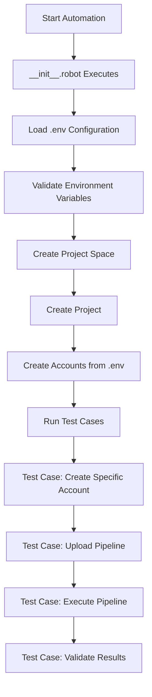

# Robot Framework Test Automation - Getting Started Guide

## Table of Contents
- [Introduction](#introduction)
- [Think Like Manual Testing First](#think-like-manual-testing-first)
- [Pre-Automation Setup](#pre-automation-setup)
- [Environment Configuration (.env)](#environment-configuration-env)
- [Account Configuration](#account-configuration)
- [Automation Workflow](#automation-workflow)
- [Writing Your First Test](#writing-your-first-test)
- [Important Notes](#important-notes)

---

## Introduction

Before diving into test automation with Robot Framework for SnapLogic, it's crucial to understand the manual process first. This guide will walk you through the necessary preparation steps and explain how the automation framework mirrors manual testing workflows.

## Think Like Manual Testing First

### What Would You Do Manually?

When testing SnapLogic manually, you would typically:

1. **Create a Project Space** - The top-level container for organizing projects
2. **Create a Project** - A workspace within the project space
3. **Create Accounts** - Database/service connections needed for pipelines
4. **Upload Required Files** - Any supporting files, schemas, or configurations
5. **Create a Pipeline** - Build and configure your data integration pipeline
6. **Test the Pipeline** - Execute and validate the pipeline behavior

The automation framework follows this exact same flow, but programmatically.

## Pre-Automation Setup

### Step 1: Create and Validate Your Pipeline Manually

Before automation begins, you need to:

1. **Create a valid pipeline** in SnapLogic UI
2. **Test it manually** to ensure it works correctly
3. **Download the pipeline** as a `.slp` file

### Follow the below guidelines while creating slp file

To make your pipelines reusable with different accounts, use **Pipeline Parameters**:

#### Create Pipeline Parameter in Your .slp File

When designing your pipeline in SnapLogic:

1. **Create a Pipeline Parameter** for the account name
   - Parameter name: `account_name` (or any descriptive name)
   - Default value: `../shared/snowflake_acct` (path to your account)

2. **Use the Pipeline Parameter** when selecting accounts in your pipeline
   - Instead of hardcoding the account, reference the pipeline parameter
   - This makes your pipeline flexible and reusable

#### Override at Runtime via Triggered Task

Since pipelines are executed using **Triggered Tasks**, you can pass different account names as parameters:

```robotframework
*** Test Cases ***
Execute Pipeline With Custom Account
    # Create a different account
    Create Snowflake Account
    ...    account_name=snowflake_test_acct    # Different name
    ...    url=${SNOWFLAKE_URL}
    ...    username=${SNOWFLAKE_USERNAME}
    ...    password=${SNOWFLAKE_PASSWORD}
    
    # Execute pipeline with custom account parameter
    ${execution_id}=    Execute Pipeline Via Triggered Task
    ...    pipeline_name=snowflake
    ...    project_path=${PROJECT_SPACE}/${PROJECT_NAME}
    ...    parameters={"account_name": "../shared/snowflake_test_acct"}
    
    # Validate results
    Wait For Pipeline Completion    ${execution_id}
    Validate Pipeline Results    ${execution_id}
```

#### Example: Pipeline Parameter Configuration

**In SnapLogic UI:**
```
Pipeline Parameters:
├── account_name (String)
│   └── Default: ../shared/snowflake_acct
└── Other parameters...
```

**In Pipeline (e.g., in a Snap):**
```
Account: _account_name (references the pipeline parameter)
```

**In Robot Test:**
```python
parameters = {
    "account_name": "../shared/custom_account_name",
    "other_param": "value"
}
```

This approach provides maximum flexibility:
- ✅ No need to modify .slp files
- ✅ Same pipeline can work with different accounts
- ✅ Easy to test with multiple account configurations
- ✅ Follows SnapLogic best practices for parameterization

### Step 3: Save Pipeline File

Save your validated `.slp` file in the correct location:
```
src/
└── pipelines/
    └── snowflake.slp
```

## Environment Configuration (.env)

The `.env` file is the heart of your test configuration. You must understand each parameter thoroughly.

### Basic Configuration Structure

```bash
# ============================================================
# MANUAL CONFIGURATION SECTION
# These values must be provided by the user
# ============================================================

# SnapLogic Instance Configuration
URL=https://example.com/
ORG_ADMIN_USER=your_username
ORG_ADMIN_PASSWORD=your_password
ORG_NAME=org_name   # Example: ml-legacy-migration

# ============================================================
# AUTOMATED CREATION SECTION
# Everything below will be created by the automation scripts
# ============================================================

# Project Configuration
PROJECT_SPACE=project_space        # Example: sl-automation-ps
PROJECT_NAME=project_name          # Example: sl_project

# Groundplex Configuration
GROUNDPLEX_NAME=groundplex_name    # Example: sl-groundplex-automation
GROUNDPLEX_ENV=groundplex_environment_name    # Example: slgroundplexautomationdev
GROUNDPLEX_LOCATION_PATH=your_groundplex_location_path    # Example: project_space/project_name/shared
RELEASE_BUILD_VERSION=build_version    # Example: main-30027

# Account Location Configuration
ACCOUNT_LOCATION_PATH="account_path"    # Example: project_space/project_name/shared
```

### Configuration Parameters Explained

| Parameter                  | Type   | Description                    | Example                                |
| -------------------------- | ------ | ------------------------------ | -------------------------------------- |
| `URL`                      | Manual | SnapLogic instance URL         | `https://elastic.snaplogic.com/`       |
| `ORG_ADMIN_USER`           | Manual | Your SnapLogic username        | `admin@company.com`                    |
| `ORG_ADMIN_PASSWORD`       | Manual | Your SnapLogic password        | `SecurePassword123`                    |
| `ORG_NAME`                 | Manual | Organization name in SnapLogic | `my-organization`                      |
| `PROJECT_SPACE`            | Auto   | Project space to be created    | `automation-tests`                     |
| `PROJECT_NAME`             | Auto   | Project name to be created     | `test-project`                         |
| `GROUNDPLEX_NAME`          | Auto   | Name for the Groundplex        | `test-groundplex`                      |
| `GROUNDPLEX_ENV`           | Auto   | Groundplex environment         | `development`                          |
| `GROUNDPLEX_LOCATION_PATH` | Auto   | Where to create Groundplex     | `automation-tests/test-project/shared` |
| `RELEASE_BUILD_VERSION`    | Auto   | SnapLogic version              | `main-30027`                           |
| `ACCOUNT_LOCATION_PATH`    | Auto   | Where to create accounts       | `automation-tests/test-project/shared` |

## Account Configuration

After the basic configuration, add account details for each service you'll connect to.

### Example: Oracle Database Account

```bash
# Oracle Database Account Configuration
ORACLE_ACCOUNT_NAME=oracle_acct        # Must match name in .slp file!
ORACLE_HOST=oracle-db                  # Database hostname
ORACLE_DATABASE=FREEPDB1                 # Database name
ORACLE_USER=SYSTEM                   # Database username
ORACLE_PASSWORD=Oracle123                # Database password
```

### Example: Snowflake Account

```bash
# Snowflake Account Configuration
SNOWFLAKE_ACCOUNT_NAME=snowflake_acct  # Must match name in .slp file!
SNOWFLAKE_URL=mycompany.snowflakecomputing.com
SNOWFLAKE_USERNAME=sf_user
SNOWFLAKE_PASSWORD=sf_password
SNOWFLAKE_WAREHOUSE=COMPUTE_WH
SNOWFLAKE_DATABASE=TEST_DB
SNOWFLAKE_SCHEMA=PUBLIC
```

### Example: MySQL Account

```bash
# MySQL Account Configuration
MYSQL_ACCOUNT_NAME=mysql_acct          # Must match name in .slp file!
MYSQL_HOST=mysql-server
MYSQL_PORT=3306
MYSQL_DATABASE=testdb
MYSQL_USERNAME=root
MYSQL_PASSWORD=mysql123
```

## Automation Workflow

### How the Automation Mirrors Manual Process



### What Happens in __init__.robot

The `__init__.robot` file handles common setup tasks that would be repetitive across all tests:

1. **Deletes existing project space** (cleanup from previous runs)
2. **Creates new project space**
3. **Creates new project**
4. **Sets up basic accounts** defined in `.env`

This ensures a clean, consistent environment for every test run.

## Writing Your First Test

### Step 1: Account Creation

Your test should first create the account that matches what's used in your `.slp` file:

```robotframework
*** Test Cases ***
Setup Snowflake Pipeline Test
    [Documentation]    Test snowflake pipeline execution
    
    # Create account with EXACT name used in snowflake.slp
    Create Snowflake Account
    ...    account_name=snowflake_acct    # MUST match .slp file
    ...    url=${SNOWFLAKE_URL}
    ...    username=${SNOWFLAKE_USERNAME}
    ...    password=${SNOWFLAKE_PASSWORD}
```

### Step 2: Upload and Execute Pipeline

```robotframework
    # Upload the pipeline
    Upload Pipeline
    ...    pipeline_path=${CURDIR}/../../src/pipelines/snowflake.slp
    ...    target_location=${PROJECT_SPACE}/${PROJECT_NAME}
    
    # Execute the pipeline
    ${execution_id}=    Execute Pipeline
    ...    pipeline_name=snowflake
    ...    project_path=${PROJECT_SPACE}/${PROJECT_NAME}
    
    # Validate results
    Wait For Pipeline Completion    ${execution_id}
    Validate Pipeline Results    ${execution_id}
```

## Important Notes

### Account Name Matching

> 🔴 **CRITICAL**: When using pipeline parameters, ensure the account path you pass matches the actual account location!

If you've configured your pipeline with parameters (as shown in Step 2), you have flexibility:
- Use the default account name from the pipeline parameter
- OR pass a different account path when executing via Triggered Task
- The account must exist at the specified path before pipeline execution 


### Best Practices

1. **Always test manually first** - Ensure your pipeline works before automating
2. **Keep .env file secure** - Never commit passwords to version control
3. **Use descriptive names** - Make project spaces, projects, and accounts easily identifiable
4. **Document dependencies** - Note any special requirements for your pipelines
5. **Clean up resources** - Ensure tests clean up after themselves

### Common Pitfalls to Avoid

| Pitfall                       | Solution                                               |
| ----------------------------- | ------------------------------------------------------ |
| Account name mismatch         | Double-check account names in .slp match test creation |
| Missing environment variables | Validate all required variables are in .env            |
| Invalid pipeline file         | Test pipeline manually before automation               |
| Incorrect paths               | Use relative paths with ${CURDIR}                      |
| Credential issues             | Verify credentials work in SnapLogic UI first          |

## Next Steps

1. **Configure your .env file** with your SnapLogic instance details
2. **Create and download** a working pipeline (.slp file)
3. **Place the pipeline** in `src/pipelines/` directory
4. **Add account configurations** to .env for all services
5. **Write your test case** following the examples above
6. **Run the test** and verify results

---

## Quick Reference Checklist

- [ ] Created and tested pipeline manually
- [ ] Downloaded .slp file to `src/pipelines/`
- [ ] Configured `.env` with instance credentials
- [ ] Added project space/name configuration
- [ ] Added account configurations to `.env`
- [ ] Account names in test match .slp file exactly
- [ ] Test creates required accounts before pipeline execution
- [ ] Test validates pipeline execution results

---

*Remember: Automation should mirror what you would do manually. Think through the manual process first, then automate it.*