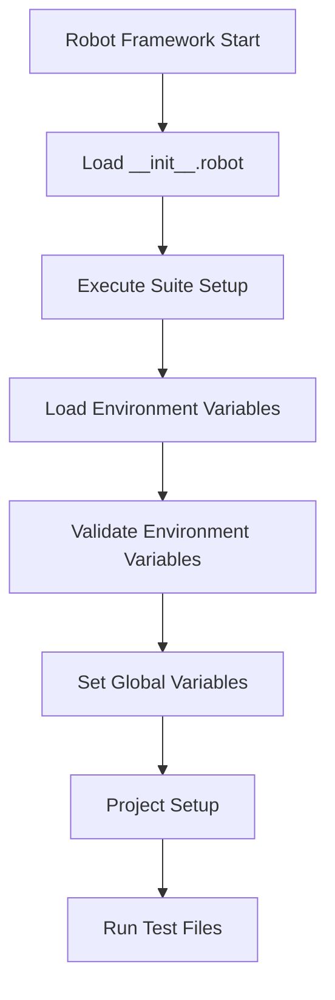

# Robot Framework `__init__.robot` File Documentation

## Table of Contents
- [Overview](#overview)
- [Purpose and Role](#purpose-and-role)
- [Execution Flow](#execution-flow)
- [File Structure Analysis](#file-structure-analysis)
- [Key Components](#key-components)
- [Environment Configuration](#environment-configuration)
- [Global Variables](#global-variables)
- [Best Practices](#best-practices)
- [Troubleshooting](#troubleshooting)

## Overview

The `__init__.robot` file is a special initialization file in Robot Framework that serves as a suite-level setup mechanism. Located at `/test/suite/__init__.robot`, this file is automatically executed before any test files in the suite directory.

## Purpose and Role

### What is `__init__.robot`?
- A **suite initialization file** that defines setup and teardown procedures for an entire test suite
- Executes **once** before any test files in the same directory
- Provides a central location for suite-wide configuration and setup

### Why Use `__init__.robot`?
1. **DRY Principle**: Avoid repeating setup code in multiple test files
2. **Consistency**: Ensure all tests start with identical environment configuration
3. **Efficiency**: Perform expensive setup operations only once
4. **Maintainability**: Centralize suite-wide configuration management
5. **Error Prevention**: Validate environment before tests run, failing fast if misconfigured

## Execution Flow



### Detailed Execution Sequence

1. **Robot Framework Initialization**
   - Discovers `__init__.robot` in the suite directory
   - Loads settings, variables, and keywords

2. **Suite Setup Execution** (`Before Suite` keyword)
   - Load environment variables from `.env` file
   - Validate required environment variables
   - Set up global variables
   - Initialize project infrastructure

3. **Test Execution**
   - Run all `.robot` files in the suite directory
   - Each test has access to global variables and setup

4. **Suite Teardown** (if defined)
   - Clean up resources after all tests complete

## File Structure Analysis

### Settings Section
```robotframework
*** Settings ***
Library         OperatingSystem      # File system operations
Library         BuiltIn             # Core Robot Framework keywords
Library         Process             # Process execution
Library         JSONLibrary         # JSON parsing capabilities
Resource        snaplogic_common_robot/snaplogic_apis_keywords/snaplogic_keywords.resource

Suite Setup     Before Suite        # Runs before any tests in the suite
```

### Variables Section
```robotframework
*** Variables ***
${ACCOUNT_PAYLOAD_PATH}     ${CURDIR}/test_data/accounts_payload
${ENV_FILE_PATH}            ${CURDIR}/../../.env
```

## Key Components

### 1. Environment Loading (`Load Environment Variables`)
- **Purpose**: Loads variables from `.env` file
- **Features**:
  - Auto-detects JSON values
  - Converts JSON to appropriate Robot Framework variables
  - Supports dictionaries, lists, and scalar values
- **Process**:
  ```
  .env file → Parse lines → Detect JSON → Set Global Variables
  ```

### 2. Environment Validation (`Validate Environment Variables`)
- **Required Variables**:
  - `URL`
  - `ORG_ADMIN_USER`
  - `ORG_ADMIN_PASSWORD`
  - `ORG_NAME`
  - `PROJECT_SPACE`
  - `PROJECT_NAME`
  - `GROUNDPLEX_NAME`
  - `GROUNDPLEX_ENV`
  - `RELEASE_BUILD_VERSION`
- **Behavior**: Fails fast if any required variable is missing

### 3. Global Variable Setup (`Set Up Global Variables`)
- Makes critical variables available to all tests
- Variables set:
  - `${ACCOUNT_PAYLOAD_PATH}`
  - `${ENV_FILE_PATH}`
  - `${ORG_NAME}`

### 4. Project Infrastructure Setup
- Deletes existing project spaces (cleanup)
- Creates new project space
- Sets up necessary accounts
- Ensures clean testing environment

## Environment Configuration

### `.env` File Format
```bash
# Basic variables
URL=https://example.snaplogic.com
ORG_ADMIN_USER=admin@example.com
ORG_ADMIN_PASSWORD=secretpassword
ORG_NAME=TestOrganization

# JSON dictionary (auto-detected)
CONFIG_DATA={"key1": "value1", "key2": "value2"}

# JSON list (auto-detected)
TEST_USERS=["user1", "user2", "user3"]
```

### Variable Auto-Detection Logic
```
Input: ENV_VAR=value
↓
Try JSON Parse
↓
Success?
├─ Yes → Is Dictionary? → Set as &{env_var}
│        Is List? → Set as @{env_var}
│        Is Primitive? → Set as ${ENV_VAR}
└─ No → Set as string ${ENV_VAR}
```

## Global Variables

### Variable Scope Hierarchy
```
Global Variables (from __init__.robot)
    ↓ Available to
    ├── All test files in /suite directory
    ├── All keywords in those test files
    └── Any nested test suites
```

### Variables Set Globally
| Variable                  | Type    | Purpose                                |
| ------------------------- | ------- | -------------------------------------- |
| `${ACCOUNT_PAYLOAD_PATH}` | String  | Path to account configuration data     |
| `${ENV_FILE_PATH}`        | String  | Path to environment configuration file |
| `${ORG_NAME}`             | String  | Organization name for testing          |
| All `.env` variables      | Various | Environment-specific configuration     |

## Best Practices

### 1. Keep Setup Lightweight
- Only include setup that's needed by ALL tests
- Move test-specific setup to individual test files

### 2. Use Clear Naming Conventions
- Prefix global variables clearly
- Use descriptive keyword names

### 3. Implement Proper Teardown
```robotframework
Suite Teardown    Clean Up Resources
```

### 4. Log Important Information
```robotframework
Log To Console    Environment loaded: ${ENV_NAME}
Log    Configuration details    level=DEBUG
```

### 5. Handle Errors Gracefully
- Validate prerequisites before complex operations
- Provide clear error messages when validation fails

## Troubleshooting

### Common Issues and Solutions

#### 1. Missing Environment Variables
**Error**: `Missing required environment variables: VAR1, VAR2`
**Solution**: 
- Check `.env` file exists at correct path
- Ensure all required variables are defined
- Verify no typos in variable names

#### 2. JSON Parsing Failures
**Symptom**: JSON values treated as strings
**Solution**:
- Ensure valid JSON syntax
- Use proper quotes in `.env` file
- Check for special characters that need escaping

#### 3. Path Resolution Issues
**Error**: File not found errors
**Solution**:
- Use `${CURDIR}` for relative paths
- Verify file structure matches expected layout
- Check file permissions

#### 4. Global Variables Not Available
**Symptom**: Tests fail with "Variable not found"
**Solution**:
- Ensure `Set Global Variable` is used (not `Set Variable`)
- Verify `__init__.robot` is in the correct directory
- Check variable name consistency (case-sensitive)

### Debug Tips

1. **Enable Console Logging**
   ```robotframework
   Log To Console    Debug: ${VARIABLE_NAME}
   ```

2. **Check Variable State**
   ```robotframework
   Log Variables    level=DEBUG
   ```

3. **Verify File Loading**
   ```robotframework
   ${exists}=    File Should Exist    ${ENV_FILE_PATH}
   Log    File exists: ${exists}
   ```

## Summary

The `__init__.robot` file is a powerful Robot Framework feature that provides:
- Centralized suite configuration
- Environment setup and validation
- Global variable management
- Infrastructure initialization

By properly utilizing this file, test suites become more maintainable, reliable, and efficient. It ensures consistent test execution environments and reduces code duplication across test files.

---

*Last Updated: 2025*
*File Location: `/test/suite/__init__.robot`*
*Framework: Robot Framework with SnapLogic Integration*